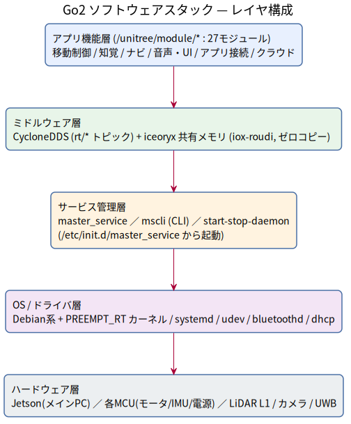
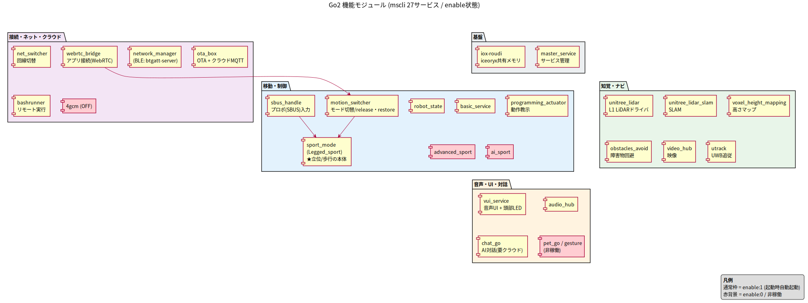
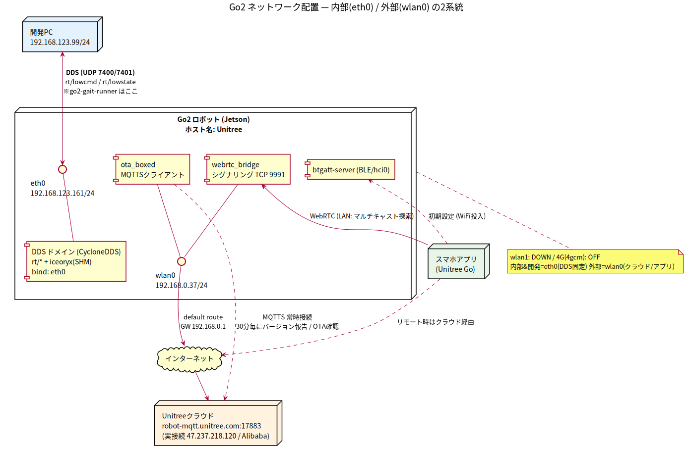
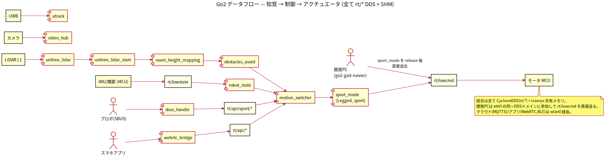

# Go2 ソフトウェアスタック構成 & 通信解析

調査日: 2026-06-16 / 対象機: ホスト名 `Unitree`、`192.168.123.161`（root でSSH）
OS: Linux `5.10.176-rt86+` aarch64 PREEMPT_RT（NVIDIA Jetson系のメイン計算機）

実機を読み取り専用で解析した結果。立ち上がり停止の調査は [disable-auto-stand.md](disable-auto-stand.md) を参照。

---

## 1. レイヤ構成（全体像）

図ソース: [img/01-layers.puml](img/01-layers.puml) — 再生成: `plantuml -tsvg img/01-layers.puml`

- **systemd 側にはロボット用ユニットは無い**。Unitree独自の `master_service` が
  `/etc/init.d/master_service`（LSB initスクリプト）経由で起動し、その配下で全機能モジュールを
  `start-stop-daemon` で起動・管理する。操作は `/unitree/sbin/mscli`。

---

## 2. 機能モジュール一覧（役割・プロセス・自動起動）

`mscli listservice` の 27 サービス。`enable:1`=起動時自動起動 / `enable:0`=起動しない。

図ソース: [img/02-modules.puml](img/02-modules.puml) — 再生成: `plantuml -tsvg img/02-modules.puml`

### 移動・制御（locomotion / control）
| サービス | 実体プロセス | enable | 役割 |
|---|---|---|---|
| **sport_mode** | `Legged_sport` | 1 | **歩行・立位の本体**。起動時に立たせる張本人。多数のDDS/UDPを保持。CPU/メモリ大 |
| advanced_sport | `advanced_sport` | 0 | 拡張運動モード（既定OFF） |
| ai_sport | `sport_runner` | 0 | AI運動モード（既定OFF） |
| motion_switcher | `motion_switcher_service` | 1 | 運動モードの切替（normal/sport/ai/advanced）。`release`/`restore` の窓口 |
| robot_state | `robot_state_service` | 1 | ロボット状態の集約・配信 |
| basic_service | `basic_service` | 1 | 基盤サービス（センサ集約等。CPU使用率が高い） |
| sbus_handle | `sbus_handle` | 1 | **SBUS** = 付属プロポ（無線送信機）入力の取り込み |
| programming_actuator | `actuator_manager.py` | 1 | プログラミング/動作教示（アクチュエータ直接操作） |

### 知覚・ナビ（perception / navigation）
| サービス | 実体プロセス | enable | 役割 |
|---|---|---|---|
| unitree_lidar | `unitree_lidar_dds_node` | 1 | L1 **LiDAR** ドライバ（`rt/utlidar/*`） |
| unitree_lidar_slam | `uslam_server` | 1 | LiDAR **SLAM**（自己位置・地図） |
| voxel_height_mapping | `voxel_height_mapping_dds_node` | 1 | 高さマップ生成（足場・段差認識） |
| obstacles_avoid | `obstacles_avoid` | 1 | 障害物回避 |
| video_hub | `videohub` | 1 | カメラ/映像ハブ（ストリーミング配信） |
| utrack | `uwb_runner` | 1 | **UWB** 追従（リモコン/タグ追尾） |

### 音声・UI・対話
| サービス | 実体プロセス | enable | 役割 |
|---|---|---|---|
| audio_hub | `audio_player_service.py` ほか | 1 | スピーカ/音声再生 |
| vui_service | `vui_service` | 1 | 音声UI + **頭部LED**（前章で使った 1001/1005/1007 API） |
| chat_go | `service.py` | 1 | AI対話（音声アシスタント、要クラウド） |
| (pet_go / gesture_recognition) | — | — | モジュールは存在するが稼働せず（ペット挙動/ジェスチャ認識） |

### 接続・ネットワーク・クラウド
| サービス | 実体プロセス | enable | 役割 |
|---|---|---|---|
| webrtc_bridge | `unitreeWebRTCClientMaster` / `xfkTon` / `multicast_responder.py` | 1 | **スマホアプリ接続**（WebRTC。映像/操作/双方向） |
| webrtc_signal_server | (xfkTon: TCP 9991) | 1 | WebRTC シグナリング |
| webrtc_multicast_responder | `multicast_responder.py` | 1 | アプリのLAN探索に応答（wlan0） |
| net_switcher | `net_switcher.py` | 1 | 回線切替（eth / WiFi / 4G） |
| network_manager | `btgatt-server` (BLE) | (1) | ネット設定。**Bluetooth GATT** でアプリからWiFi設定等 |
| 4gcm | — | 0 | 4G セルラーモデム（SIM未使用＝OFF） |
| ota_box | `ota_boxed` | 1 | **OTA更新 + クラウドMQTT**（Unitreeクラウド常時接続） |
| bashrunner | `bashrunner.py` | 1 | リモートからのスクリプト/コマンド実行フック |
| iox-roudi | `iox-roudi` | 1 | **iceoryx 共有メモリブローカ**（DDSのゼロコピー基盤） |
| master_service | `master_service` | (init) | サービス管理本体 |

---

## 3. 内部通信（intra-robot / 開発PC ↔ ロボット）

### 3.1 CycloneDDS（主役）
- 設定 `/unitree/etc/cyclonedds.xml`:
  - `Domain Id="any"`、**バインドIF = `eth0`**、`multicast=default`、TopicDiscovery 有効、
    **SharedMemory = true**（iceoryx 併用）。
  - SHM無効版 `cyclonedds_noshm.xml` も同梱（`SharedMemory=false`）。
- ほぼ全モジュールが **UDP 7400/7401**（DDS の SPDP/SEDP ディスカバリ）を開いて相互接続。
  データは動的ポート（例 `Legged_sport` の 7667 など）。
- トピック名前空間は `rt/*`（例）:
  - `rt/lowcmd` / `rt/lowstate` … 低レベル指令・状態（**本ランナーが使う**）
  - `rt/sportmodestate`, `rt/api/sport/*` … 高レベル運動
  - `rt/utlidar/*`（LiDAR/スイッチ）, `rt/api/vui/*`（LED/音声）, `rt/api/motion_switcher/*`
- **開発PC ↔ ロボットは、この eth0 上の DDS で通信**する（PC を `192.168.123.99/24` にして
  同一 DDS ドメインに参加 → `rt/lowcmd` 送信 / `rt/lowstate` 受信）。go2-gait-runner も同じ。

### 3.2 iceoryx（iox-roudi）— 同一ホスト内ゼロコピー
- `/unitree/sbin/iox-roudi` が共有メモリブローカ。`/dev/shm/iceoryx_mgmt`(~66MB) と
  `/dev/shm/root`(~149MB) のセグメントを管理。
- 同一機内のモジュール間（例: LiDAR→SLAM→height map→sport）は DDS APIのまま **共有メモリで
  ゼロコピー転送**され、ネットワークを介さない（低遅延）。

### 3.3 サービス制御 RPC
- `mscli` ↔ `master_service` は protobuf（`master_service.proto`）の IPC。非rootでも実行可。
- `motion_switcher` / `vui` などは Unitree RPC（DDS `rt/api/*` request/response）。
  本ランナーの `release`/`restore`/LED 制御はこの経路。

---

## 4. 外部通信（ロボット ↔ 外）

### 4.1 ネットワーク構成（2系統）

図ソース: [img/03-network.puml](img/03-network.puml) — 再生成: `plantuml -tsvg img/03-network.puml`

- **eth0** = ロボット内部＆開発接続用（DDSはここに固定）。**wlan0** = 外部インターネット用。
  この分離により、有線で低レベル制御しつつ無線でクラウド/アプリ、という運用になっている。

### 4.2 クラウド（Unitree）— 常時 MQTTS
- 設定 `/unitree/etc/mqtt/mqtt_client_conf.json`:
  - `mqtts://robot-mqtt.unitree.com:17883`（CN） / `global-robot-mqtt.unitree.com:17883`（default）
  - TLS、自動再接続、KeepAlive 10s。
- **実接続を確認**: `ota_boxed` (pid 709) が `wlan0` から
  `47.237.218.120:17883`（Alibaba Cloud）へ ESTABLISHED。
  → バージョン報告（`ReportVersionInterval:1800s`）と OTA 更新チェック（`CheckUpdateInterval:5`）を
    クラウドMQTTで実施。`chat_go`（AI対話）も外部依存。
- ⚠ つまり **wlan0 がインターネットに繋がっていると、Unitreeクラウドへ定期的に状態送信＆更新確認**を行う。
  オフライン運用したい場合は wlan0 を切る/接続しない、または ota_box を止める（要検討、本書「未検証」）。

### 4.3 スマホアプリ（Unitree Go）— WebRTC / BLE
- **WebRTC**: `webrtc_bridge`（`unitreeWebRTCClientMaster` + シグナリング `xfkTon` が
  **TCP 9991** で LISTEN）。映像・操作・双方向通信。
- **LAN探索**: `multicast_responder.py` が wlan0 (`192.168.0.37`) でアプリのマルチキャスト探索に応答。
- **Bluetooth**: `network_manager/upper_bluetooth/btgatt-server`（BLE GATT, hci0）。
  アプリ初期設定（WiFiパスワード投入等）に使用。
- LAN内ではアプリ→ロボットを WebRTC で直結、リモート時はクラウド経由でリレー（MQTT/シグナリング）。

### 4.4 リッスンしている主なポート
| ポート | プロセス | 用途 |
|---|---|---|
| TCP 22 | sshd | SSH（開発） |
| TCP 9991 | xfkTon (webrtc) | WebRTC シグナリング |
| UDP 7400/7401 | 全DDSモジュール | DDS ディスカバリ（SPDP/SEDP） |
| UDP 7667 ほか動的 | Legged_sport ほか | DDS データ |
| UDP 5353 | avahi-daemon | mDNS |
| UDP 67/68/546 | udhcpd / dhcpcd | DHCP（eth0で配布, wlan0で取得） |
| UDP 53 | systemd-resolved | DNS |

---

## 5. データフロー（知覚→制御→アクチュエータ）

図ソース: [img/04-dataflow.puml](img/04-dataflow.puml) — 再生成: `plantuml -tsvg img/04-dataflow.puml`

---

## 6. ポイント整理

- **2層の通信分離**: 内部＆開発＝eth0のDDS（+SHM）、外部＝wlan0（クラウドMQTTS / アプリWebRTC / BLE）。
- **DDSが結合の中心**: ほぼ全モジュールが `rt/*` トピックで疎結合。開発PCも同じドメインに入れば
  対等に参加でき、これが go2-gait-runner の通信基盤。
- **クラウド常時接続**: wlan0 がネットに出ていると Unitree クラウドへ定期送信＋OTA確認。
  プライバシ/オフライン運用では wlan0 切断が要検討。
- **アプリ接続の3経路**: WebRTC(LAN/クラウド) + BLE(初期設定) + マルチキャスト探索。
- **立ち上がり**は sport_mode/`Legged_sport`。停止方法は [disable-auto-stand.md](disable-auto-stand.md)。

## 7. 未検証・深掘り候補
- `rt/*` トピックの実在一覧（`idlc`/DDS購読での動的列挙、unitree_sdk2 の topic 定義との突き合わせ）。
- `bashrunner` がどの経路（MQTT/DDS）からコマンドを受けるか（リモート実行面のセキュリティ）。
- クラウドへ送信される具体的内容（テレメトリ範囲）。
- `ota_box`/wlan0 を止めた場合の他機能への影響（chat_go 等）。
- `basic_service` の高CPUの内訳。
